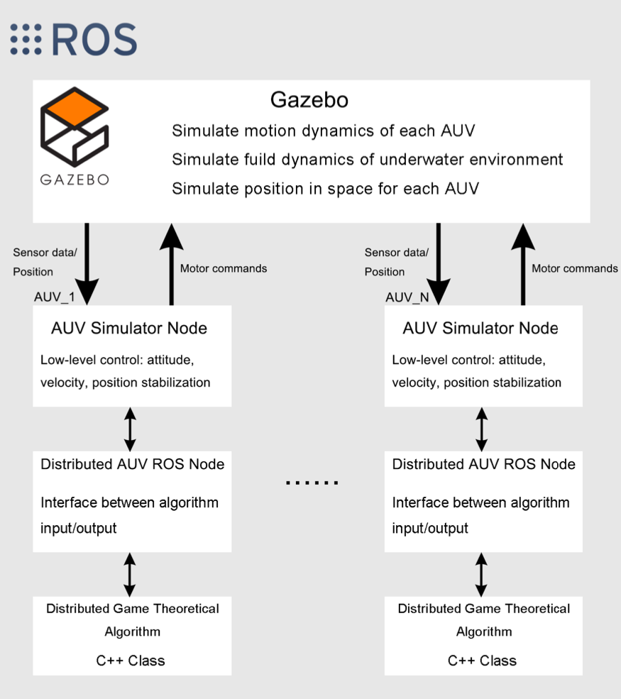
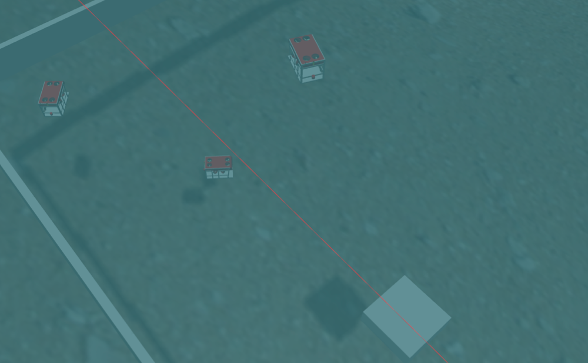
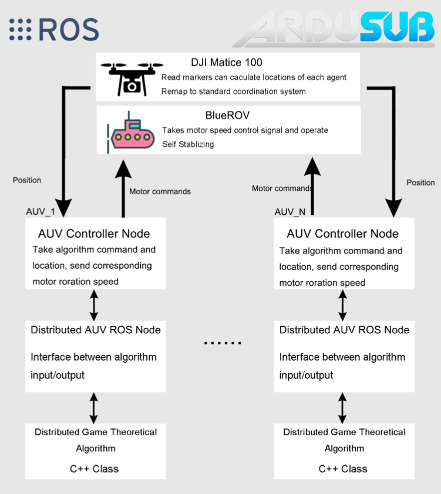
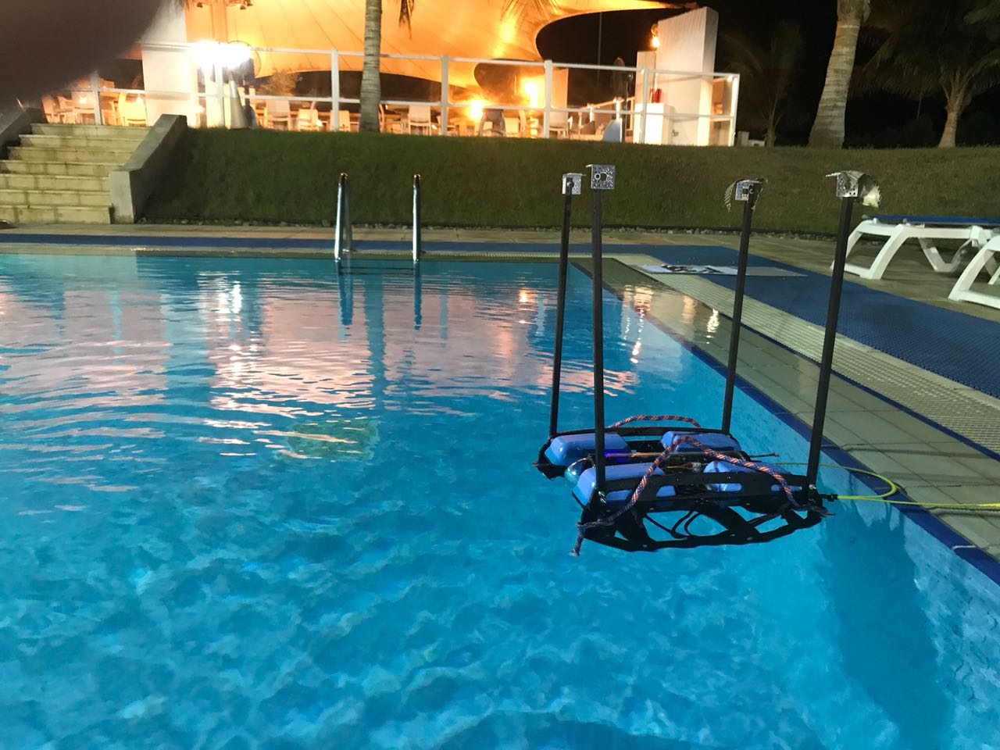
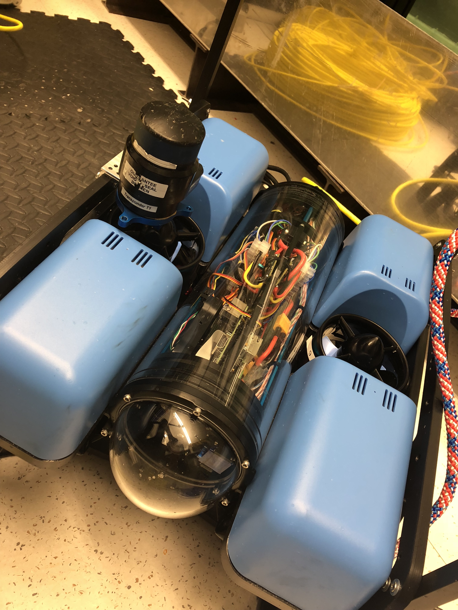
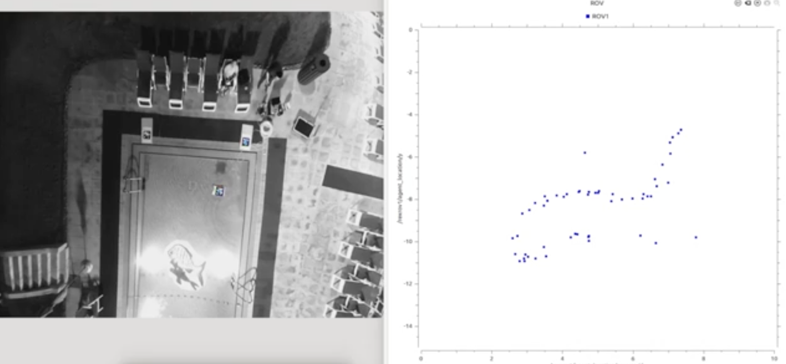

# multirov
A software package for multiple autonomous underwater vehicles (AUVs), both in simulation and hardware experiments. See the appendix of [thesis pdf](https://repository.kaust.edu.sa/handle/10754/627955) for detailed information. 

Simulation software architecture

Simulation running scene

Hardware implementation architecture

Hardware pictures

Hardware experument running scene

